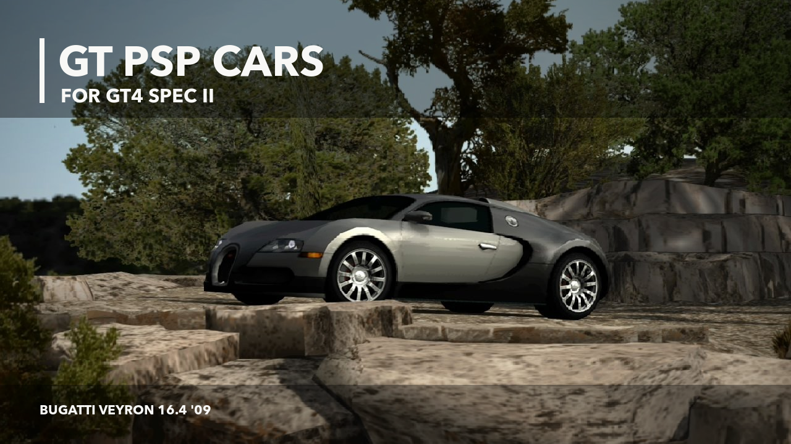
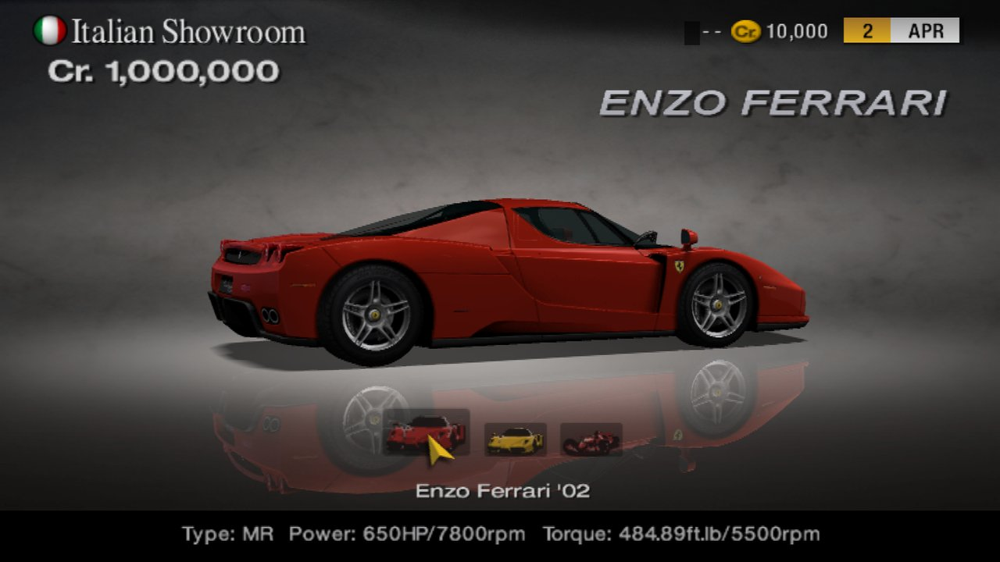
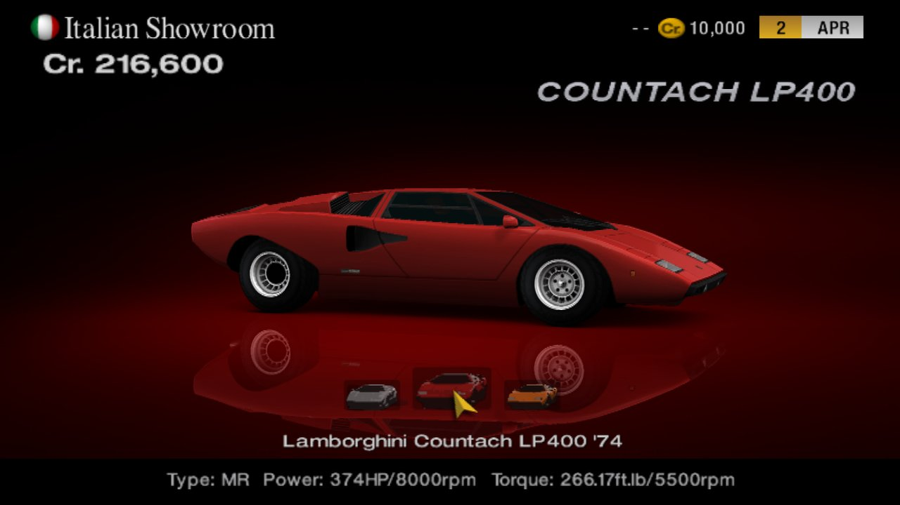
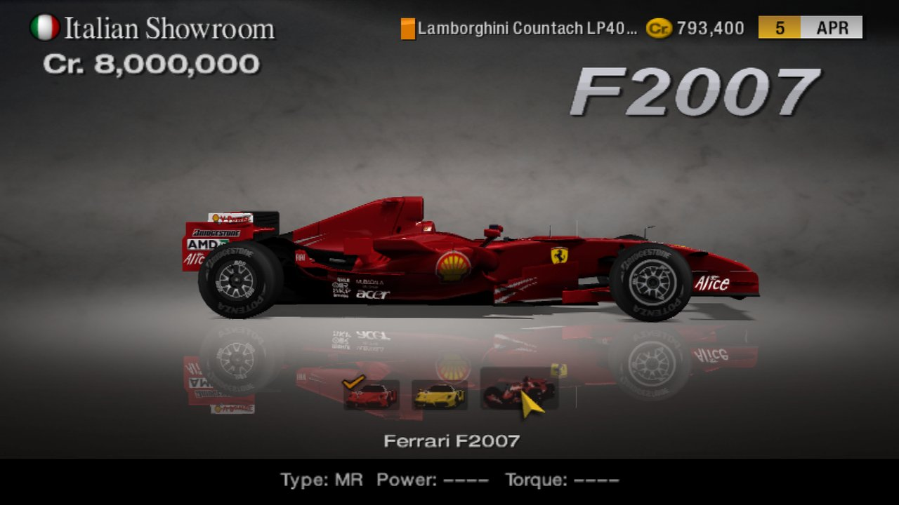
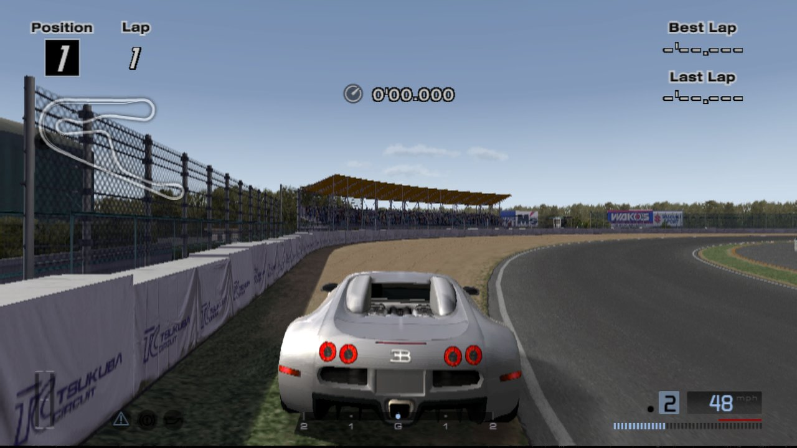

# GT PSP cars for Gran Turismo 4 Spec II

33 cars from *Gran Turismo PSP* are now in *Gran Turismo 4 Spec II v1.10*. The Veyron, Enzo, F2007, Countach, Furai, GT by Citroën and more can be bought and driven in GT Mode.

Ferrari, Lamborghini and Bugatti have their own dealers and tune shops. They're also in Arcade Mode's **By Make** list. This is a patch for **Spec II v1.10 NTSC-U only**.

**[Download the patch](https://github.com/Memetrix/gt4-psp-cars-spec-ii/releases/latest)** · **[Install guide](INSTALL.md)**

## In the game

| Ferrari Enzo at the dealer | Lamborghini Countach at the dealer |
|:---:|:---:|
|  |  |

| Ferrari F2007 | Bugatti Veyron on track |
|:---:|:---:|
|  |  |

[Arcade By Make](screenshots/arcade-by-make.jpg) · [Original Veyron Photo Travel shot](screenshots/veyron-photo-travel.jpg)

Of the 33 entries, 20 use car models converted from GT PSP, with their wheels and colours. The other 13 are PSP variants built on matching GT4 bodies. Some entries are special-colour versions. The full list is in the [release notes](https://github.com/Memetrix/gt4-psp-cars-spec-ii/releases/latest).

You need your own clean *GT4 Spec II v1.10 NTSC-U* ISO. The download contains an xdelta patch, not an ISO. The clean ISO's MD5 is `2c89bc11ccf68dc68f8af39c9e75096a`. [Delta Patcher](https://github.com/marco-calautti/DeltaPatcher/releases) applies it on Windows and macOS.

## Current limits

Engine sounds and lights use the closest available GT4 donors. The Veyron's wing is static, and the new cars aren't in By Era or the existing AI lineups. Dealer and tune-shop photos are generated art; the screenshots above are from the game.

This fan patch is unaffiliated with Polyphony Digital or Sony. Car names and marks belong to their owners. Thanks to the GT4 Spec II team, TheAdmiester, Nenkai, Razer2015, N4gtan, and the PCSX2 and PPSSPP teams.
